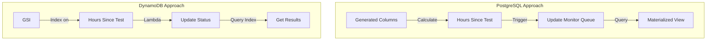

# Database Comparison: PostgreSQL vs DynamoDB for Hospital Monitoring

## Use Case Requirements

1. **Core Functionality**
   - Monitor patients without tests for >48 hours
   - Process updates from two data sources (PMS and LIS)
   - Support real-time monitoring
   - Handle thousands of patients

2. **Performance Requirements**
   - Sub-second query response
   - Real-time data processing
   - Efficient monitoring queries
   - Scalable solution

## Comparison Matrix

### 1. 48-Hour Monitoring Implementation



#### PostgreSQL
- **Pros**
  - Complex calculations in database
  - Automated triggers for updates
  - Transaction support
  - Materialized views for performance
- **Cons**
  - Complex setup and maintenance
  - Scaling complexity
  - Connection management overhead
  - Higher operational cost

#### DynamoDB
- **Pros**
  - Simple GSI-based queries
  - Automatic scaling
  - Serverless friendly
  - Low maintenance
- **Cons**
  - Application-level calculations
  - Eventually consistent by default
  - Less flexible queries
  - Higher data duplication

### 2. Performance Comparison

| Aspect | PostgreSQL | DynamoDB |
|--------|------------|----------|
| Query Latency | Variable (50-500ms) | Consistent (<10ms) |
| Scaling | Manual/Complex | Automatic |
| Data Size | TB+ | Unlimited |
| Maintenance | Regular | Minimal |

### 3. Cost Analysis

#### PostgreSQL
```
Monthly Cost Estimate:
- db.r6g.large: $150/month
- Storage (100GB): $20/month
- Backup: $10/month
- Network: $30/month
Total: ~$210/month
```

#### DynamoDB
```
Monthly Cost Estimate (On-Demand):
- Write Units: $0.25 per million
- Read Units: $0.05 per million
- Storage: $0.25 per GB
Estimated Total: ~$100-150/month
```

## Case for DynamoDB

### 1. Better Fit for Requirements
- **Serverless Architecture**
  - Natural fit with Lambda functions
  - No connection management
  - Automatic scaling

- **Real-time Processing**
  ```javascript
  // Simple, efficient queries
  const params = {
    TableName: "Admissions",
    IndexName: "MonitoringIndex",
    KeyConditionExpression: 
      "status = :status AND hoursSinceTest >= :hours",
    ExpressionAttributeValues: {
      ":status": "Active",
      ":hours": 48
    }
  };
  ```

- **Monitoring Efficiency**
  - Direct access through GSI
  - No complex joins needed
  - Predictable performance

### 2. Operational Benefits

- **Scaling**
  - Automatic scaling without intervention
  - No performance tuning needed
  - No connection limits

- **Maintenance**
  - No schema migrations
  - No index rebuilding
  - No vacuum operations

- **Monitoring**
  - Built-in CloudWatch metrics
  - Automatic backup management
  - Simplified security model

### 3. Development Advantages

- **Simpler Code**
  ```typescript
  // DynamoDB: Simple query pattern
  async function getPatientsNeedingTests() {
    return dynamodb.query({
      IndexName: "MonitoringIndex",
      KeyConditionExpression: "status = :s AND hoursSinceTest >= :h",
      ExpressionAttributeValues: { ":s": "Active", ":h": 48 }
    });
  }

  // PostgreSQL: More complex query pattern
  async function getPatientsNeedingTests() {
    return pool.query(`
      SELECT * FROM mv_patients_needing_tests 
      WHERE status = 'Active' 
      AND extract(epoch from (now() - last_test_date))/3600 >= 48
    `);
  }
  ```

- **Deployment**
  - No database migration scripts
  - Simpler CI/CD pipeline
  - Infrastructure as code friendly

## Recommendation: Use DynamoDB

### Key Reasons:
1. **Simpler Architecture**
   - Fewer moving parts
   - Less operational overhead
   - Better serverless integration

2. **Better Performance**
   - Consistent latency
   - Automatic scaling
   - No query optimization needed

3. **Lower Total Cost**
   - Pay-per-request pricing
   - No idle capacity costs
   - Reduced operational costs

4. **Future-Proof**
   - Easy to scale
   - Simple to extend
   - Cloud-native design

### Next Steps:
1. Create DynamoDB tables and indexes
2. Implement Lambda functions for data processing
3. Set up monitoring and alerts
4. Deploy initial version
5. Monitor performance and costs

The DynamoDB approach provides a more maintainable, scalable, and cost-effective solution for the hospital monitoring system, particularly well-suited for the 48-hour monitoring requirement.