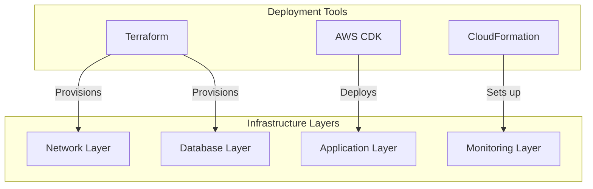
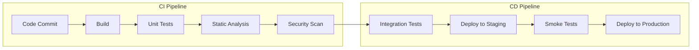

# Deployment Strategy

## Infrastructure as Code (IaC)



## 1. Environment Strategy

### Production Environment
- Multi-AZ deployment
- Read replicas for database
- Full monitoring and alerting
- Production-grade security measures

### Staging Environment
- Single-AZ deployment
- Reduced infrastructure footprint
- Full feature testing capability
- Integration testing environment

### Development Environment
- Local development setup
- Docker containers for services
- Mock S3 events
- Local database instance

## 2. CI/CD Pipeline



### CI Steps
1. **Code Quality**
   ```yaml
   # .github/workflows/ci.yml
   steps:
     - name: Lint
       run: |
         pylint src/
         eslint frontend/
         
     - name: Type Check
       run: |
         mypy src/
         tsc --noEmit
         
     - name: Unit Tests
       run: |
         pytest tests/unit
         npm test
   ```

2. **Security Checks**
   ```yaml
   steps:
     - name: SAST
       uses: github/codeql-action/analyze
       
     - name: Dependency Scan
       run: |
         safety check
         npm audit
   ```

### CD Steps
1. **Database Migrations**
   ```bash
   # scripts/migrate.sh
   alembic upgrade head
   ```

2. **Lambda Deployment**
   ```yaml
   steps:
     - name: Package Lambda
       run: |
         sam package \
           --template-file template.yaml \
           --s3-bucket deployment-artifacts
         
     - name: Deploy Lambda
       run: |
         sam deploy \
           --template-file template.yaml \
           --stack-name hospital-integration
   ```

## 3. Database Deployment

### Migration Strategy
```sql
-- migrations/V1__initial_schema.sql
CREATE TABLE patients (
    -- schema definition
);

-- migrations/V2__add_indexes.sql
CREATE INDEX idx_patient_admission ON admissions(patient_id);
```

### Rollback Procedures
```sql
-- rollbacks/V1__initial_schema_rollback.sql
DROP TABLE patients CASCADE;

-- rollbacks/V2__add_indexes_rollback.sql
DROP INDEX idx_patient_admission;
```

## 4. Application Deployment

### Frontend Deployment
```yaml
# frontend/deploy.yml
steps:
  - name: Build
    run: npm run build
    
  - name: Deploy to S3
    run: |
      aws s3 sync build/ s3://hospital-frontend
      aws cloudfront create-invalidation --distribution-id $CDN_ID
```

### Backend Deployment
```yaml
# backend/deploy.yml
steps:
  - name: Deploy Lambdas
    run: |
      for function in data_ingestion alert_generator api_handler; do
        aws lambda update-function-code \
          --function-name $function \
          --zip-file fileb://dist/$function.zip
      done
```

## 5. Monitoring Setup

### CloudWatch Dashboards
```yaml
# monitoring/dashboard.yml
widgets:
  - type: metric
    properties:
      metrics:
        - [ "AWS/Lambda", "Duration", "FunctionName", "data_ingestion" ]
        - [ "AWS/Lambda", "Errors", "FunctionName", "data_ingestion" ]
      period: 300
```

### Alerts Configuration
```yaml
# monitoring/alerts.yml
alerts:
  - name: HighErrorRate
    condition: errors > 5
    period: 5m
    actions:
      - sns:alert-team
```

## 6. Rollback Procedures

### Database Rollback
1. Verify backup point
2. Execute rollback scripts
3. Validate data integrity
4. Update application version

### Application Rollback
1. Revert Lambda versions
2. Restore frontend version
3. Validate system health
4. Monitor error rates

## 7. Deployment Checklist

### Pre-deployment
- [ ] Review changes
- [ ] Run integration tests
- [ ] Check dependencies
- [ ] Verify database migrations
- [ ] Update documentation

### Deployment
- [ ] Execute database migrations
- [ ] Deploy backend changes
- [ ] Deploy frontend changes
- [ ] Update configuration
- [ ] Verify monitoring

### Post-deployment
- [ ] Run smoke tests
- [ ] Monitor error rates
- [ ] Check performance metrics
- [ ] Verify alerts
- [ ] Update status page

## 8. Disaster Recovery

### Backup Strategy
- Daily database snapshots
- S3 version control
- Configuration backups
- Audit logs retention

### Recovery Procedures
1. Assess incident scope
2. Restore from backup
3. Verify data integrity
4. Update DNS/routing
5. Validate system health

## 9. Security Measures

### Access Control
- AWS IAM roles
- Database user management
- API authentication
- Audit logging

### Encryption
- Data at rest
- Data in transit
- Key management
- Certificate rotation

This deployment strategy ensures reliable, secure, and consistent deployments across all environments while maintaining system stability and performance.