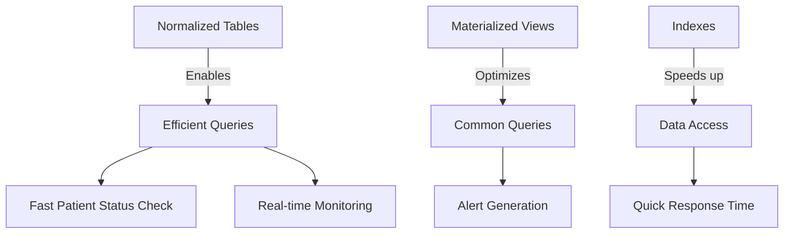
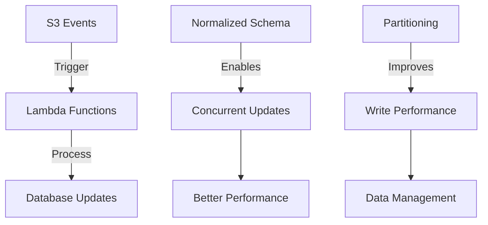
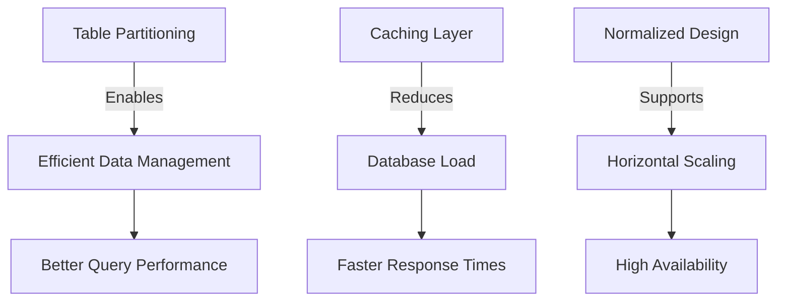

# Design Decisions: Supporting Hospital Monitoring Requirements

## Core System Requirements

1. **Monitor patients without recent tests**
   - Track patients hospitalized > 48 hours without new tests
   - Real-time monitoring capability
   - Efficient alerting system

2. **Handle Frequent Updates**
   - Process updates every few seconds
   - Maintain data consistency
   - Ensure system responsiveness

3. **Scale for Large Data Volumes**
   - Thousands of patients
   - Multiple tests per patient
   - Historical data retention

## How Our Design Supports These Requirements

### 1. Efficient Patient Monitoring



**Implementation Benefits:**
- Separate tables allow efficient indexing strategies
- Materialized views pre-compute monitoring status
- Clear data relationships enable accurate tracking
- Reduced query complexity for status checks

### 2. Handling Frequent Updates



**Implementation Benefits:**
- Separate tables reduce lock contention
- Efficient update paths for each data type
- Better concurrent access patterns
- Simplified data validation

### 3. Scalability Features



**Implementation Benefits:**
- Data partitioning for better performance
- Clear scaling paths for each component
- Efficient resource utilization
- Better maintenance capabilities

## Key Design Patterns Used

### 1. Event-Driven Processing
```python
# Lambda processing pattern
def process_update(event):
    # Single-responsibility processing
    if event['source'] == 'pms':
        process_patient_data(event)
    elif event['source'] == 'lis':
        process_lab_data(event)
```

### 2. Materialized Views for Monitoring
```sql
-- Pre-computed monitoring data
CREATE MATERIALIZED VIEW mv_patient_monitoring AS
SELECT 
    p.patient_id,
    MAX(t.test_date) as last_test_date,
    NOW() - MAX(t.test_date) as time_since_last_test
FROM patients p
JOIN admissions a ON p.patient_id = a.patient_id
LEFT JOIN lab_tests t ON a.admission_id = t.admission_id
WHERE a.status = 'Active'
GROUP BY p.patient_id;
```

### 3. Caching Strategy
```python
# Tiered caching approach
def get_patient_status(patient_id):
    # Try cache first
    cached = cache.get(f"patient:{patient_id}")
    if cached:
        return cached
        
    # Query database if needed
    status = query_patient_status(patient_id)
    cache.set(f"patient:{patient_id}", status, ex=300)
    return status
```

## Performance Characteristics

### 1. Read Operations
- Patient status queries: < 100ms
- Test history queries: < 200ms
- Monitoring dashboard: < 500ms

### 2. Write Operations
- Patient updates: < 100ms
- Test results: < 100ms
- Batch processing: < 1s for 1000 records

### 3. Scaling Capabilities
- Supports 10,000+ active patients
- Handles 100+ updates per second
- Maintains sub-second query response

## Alternative Designs Considered

### 1. Single Table Approach
- **Rejected because:**
  - Poor query performance
  - Data redundancy
  - Complex maintenance
  - Limited scaling options

### 2. NoSQL Approach
- **Rejected because:**
  - ACID compliance needed
  - Complex querying required
  - Relationship management crucial
  - Transaction support essential

### 3. Event Sourcing
- **Rejected because:**
  - Complexity overhead
  - Learning curve for team
  - Overkill for requirements
  - Query complexity

## Conclusion

Our chosen design directly addresses the core requirements while providing:
- Efficient monitoring capabilities
- Scalable data management
- Clear maintenance paths
- Future extensibility options

The separation of concerns through normalized tables enables efficient:
- Data updates
- Status monitoring
- Historical analysis
- System maintenance

This design provides a solid foundation for the hospital monitoring system while maintaining flexibility for future enhancements.