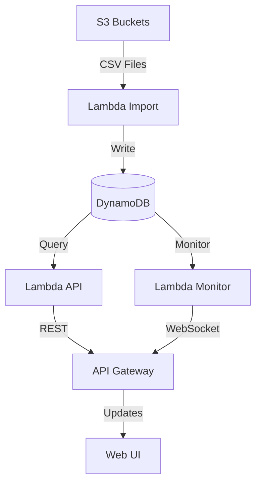

# DynamoDB Design for Hospital Monitoring System

## Table Design

### 1. Patients Table
```javascript
{
  TableName: "Patients",
  KeySchema: [
    { AttributeName: "PK", KeyType: "HASH" },  // PK = PATIENT#${patientId}
    { AttributeName: "SK", KeyType: "RANGE" }   // SK = METADATA
  ],
  GlobalSecondaryIndexes: [
    {
      IndexName: "NameIndex",
      KeySchema: [
        { AttributeName: "lastName", KeyType: "HASH" },
        { AttributeName: "firstName", KeyType: "RANGE" }
      ]
    }
  ],
  AttributeDefinitions: [
    { AttributeName: "PK", AttributeType: "S" },
    { AttributeName: "SK", AttributeType: "S" },
    { AttributeName: "lastName", AttributeType: "S" },
    { AttributeName: "firstName", AttributeType: "S" }
  ]
}

// Example Item
{
  "PK": "PATIENT#P12345",
  "SK": "METADATA",
  "firstName": "John",
  "lastName": "Doe",
  "dateOfBirth": "1980-05-15",
  "gender": "M",
  "updatedAt": "2023-05-08T15:30:00Z"
}
```

### 2. Admissions Table
```javascript
{
  TableName: "Admissions",
  KeySchema: [
    { AttributeName: "PK", KeyType: "HASH" },  // PK = PATIENT#${patientId}
    { AttributeName: "SK", KeyType: "RANGE" }   // SK = ADMISSION#${admissionId}
  ],
  GlobalSecondaryIndexes: [
    {
      IndexName: "MonitoringIndex",
      KeySchema: [
        { AttributeName: "status", KeyType: "HASH" },
        { AttributeName: "hoursSinceTest", KeyType: "RANGE" }
      ],
      Projection: { ProjectionType: "ALL" }
    },
    {
      IndexName: "WardIndex",
      KeySchema: [
        { AttributeName: "ward", KeyType: "HASH" },
        { AttributeName: "bedNumber", KeyType: "RANGE" }
      ]
    }
  ]
}

// Example Item
{
  "PK": "PATIENT#P12345",
  "SK": "ADMISSION#ADM789",
  "admissionDate": "2023-05-06T08:30:00Z",
  "ward": "Cardiology",
  "bedNumber": "C-123",
  "status": "Active",
  "lastTestDate": "2023-05-06T10:30:00Z",
  "hoursSinceTest": 48,
  "needsAttention": true,
  "updatedAt": "2023-05-08T15:30:00Z"
}
```

### 3. Tests Table
```javascript
{
  TableName: "Tests",
  KeySchema: [
    { AttributeName: "PK", KeyType: "HASH" },  // PK = ADMISSION#${admissionId}
    { AttributeName: "SK", KeyType: "RANGE" }   // SK = TEST#${timestamp}#${testId}
  ],
  GlobalSecondaryIndexes: [
    {
      IndexName: "PatientTestIndex",
      KeySchema: [
        { AttributeName: "patientId", KeyType: "HASH" },
        { AttributeName: "testDate", KeyType: "RANGE" }
      ]
    }
  ]
}

// Example Item
{
  "PK": "ADMISSION#ADM789",
  "SK": "TEST#2023-05-06T10:30:00Z#T98765",
  "patientId": "P12345",
  "testType": "Blood Count",
  "testDate": "2023-05-06T10:30:00Z",
  "result": "Normal",
  "status": "Completed",
  "labLocation": "Main Lab",
  "updatedAt": "2023-05-06T10:35:00Z"
}
```

## Access Patterns

### 1. Find Patients Without Recent Tests
```javascript
// Query MonitoringIndex on Admissions table
const params = {
  TableName: "Admissions",
  IndexName: "MonitoringIndex",
  KeyConditionExpression: 
    "status = :status AND hoursSinceTest >= :hours",
  ExpressionAttributeValues: {
    ":status": "Active",
    ":hours": 48
  }
};
```

### 2. Update Patient Test Status
```javascript
// Lambda function to process new test
async function processNewTest(test) {
  // Add test record
  await dynamodb.put({
    TableName: "Tests",
    Item: {
      PK: `ADMISSION#${test.admissionId}`,
      SK: `TEST#${test.testDate}#${test.testId}`,
      patientId: test.patientId,
      // ... other test data
    }
  });

  // Update admission record
  await dynamodb.update({
    TableName: "Admissions",
    Key: {
      PK: `PATIENT#${test.patientId}`,
      SK: `ADMISSION#${test.admissionId}`
    },
    UpdateExpression: 
      "SET lastTestDate = :testDate, hoursSinceTest = :hours",
    ExpressionAttributeValues: {
      ":testDate": test.testDate,
      ":hours": 0
    }
  });
}
```

### 3. Real-time Monitoring
```javascript
// Lambda function to update monitoring status
async function updateMonitoringStatus() {
  const now = new Date();
  
  // Query for active admissions
  const admissions = await dynamodb.query({
    TableName: "Admissions",
    IndexName: "MonitoringIndex",
    KeyConditionExpression: "status = :status",
    ExpressionAttributeValues: {
      ":status": "Active"
    }
  });

  // Update hours since test
  for (const admission of admissions.Items) {
    const hoursSinceTest = 
      (now - new Date(admission.lastTestDate)) / (1000 * 60 * 60);
    
    await dynamodb.update({
      TableName: "Admissions",
      Key: {
        PK: admission.PK,
        SK: admission.SK
      },
      UpdateExpression: "SET hoursSinceTest = :hours",
      ExpressionAttributeValues: {
        ":hours": Math.floor(hoursSinceTest)
      }
    });
  }
}
```

## System Architecture with DynamoDB



## Benefits of DynamoDB Approach

1. **Scalability**
   - Automatic scaling without maintenance
   - Pay-per-request pricing model
   - No connection management needed

2. **Performance**
   - Consistent single-digit millisecond latency
   - No complex query optimization needed
   - Efficient index usage

3. **Real-time Processing**
   - Event-driven architecture
   - Stream processing capabilities
   - Immediate data consistency

4. **Cost Efficiency**
   - No idle capacity costs
   - Automatic scaling
   - Free tier benefits

## Implementation Strategy

1. **Data Migration**
   - Import historical data using AWS DMS
   - Validate data consistency
   - Switch traffic gradually

2. **Monitoring Setup**
   - CloudWatch alarms for thresholds
   - DynamoDB Streams for updates
   - Lambda metrics dashboard

3. **Testing**
   - Load testing with varied data volumes
   - Failover scenarios
   - Cost monitoring

This design provides a scalable, maintainable solution that meets the hospital monitoring requirements while minimizing operational overhead.