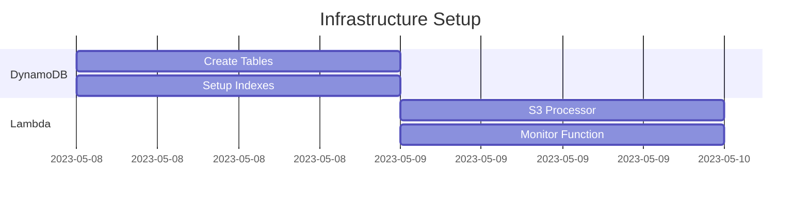
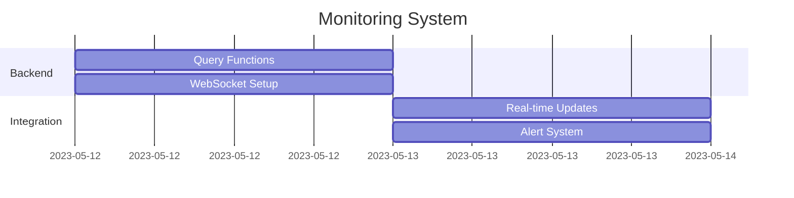
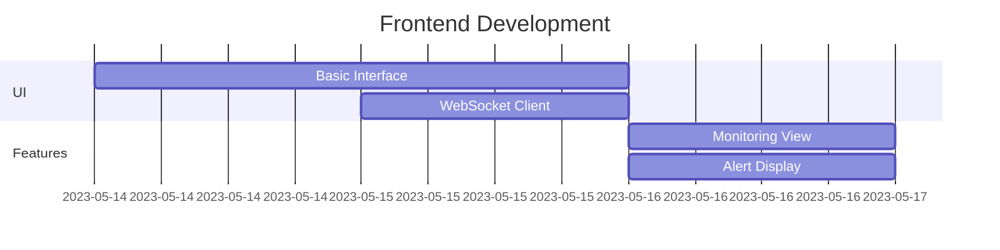
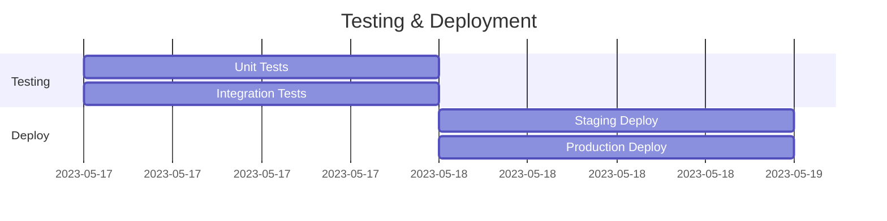

# Implementation Plan - Serverless Architecture

## Phase 1: Infrastructure Setup (Days 1-2)



### Tasks:
1. Initialize Serverless Framework project
   ```bash
   serverless create --template aws-nodejs-typescript
   ```

2. Set up DynamoDB tables
   - Patients table
   - Admissions table
   - Tests table
   - Configure indexes

3. Configure Lambda IAM roles
   - S3 read access
   - DynamoDB access
   - WebSocket API access

## Phase 2: Data Processing Implementation (Days 3-4)


### Tasks:
1. Implement CSV processors
   - PMS data processor
   - LIS data processor
   - Data validation

2. Set up error handling
   - Validation errors
   - Processing errors
   - DynamoDB errors

3. Configure monitoring
   - CloudWatch metrics
   - Error logging
   - Performance tracking

## Phase 3: Monitoring Implementation (Days 5-6)



### Tasks:
1. Implement core monitoring
   ```typescript
   // Example monitoring query
   const params = {
     TableName: process.env.ADMISSIONS_TABLE!,
     IndexName: 'MonitoringIndex',
     KeyConditionExpression: 
       'status = :status AND hoursSinceTest >= :hours',
     ExpressionAttributeValues: {
       ':status': 'Active',
       ':hours': 48
     }
   };
   ```

2. Set up WebSocket API
   - Connection management
   - Real-time updates
   - Client messaging

3. Configure alerts
   - Alert conditions
   - Notification system
   - Alert tracking

## Phase 4: Frontend Development (Days 7-9)



### Tasks:
1. Set up React application
   - TypeScript configuration
   - API integration
   - WebSocket client

2. Implement UI components
   - Patient monitoring table
   - Alert notifications
   - Filtering system

3. Add real-time updates
   - WebSocket connection
   - Data synchronization
   - Error handling

## Phase 5: Testing and Deployment (Days 10-11)



### Tasks:
1. Implement tests
   ```typescript
   // Example test structure
   describe('Patient Monitoring', () => {
     it('should identify patients without tests', async () => {
       // Test implementation
     });

     it('should send real-time updates', async () => {
       // Test implementation
     });
   });
   ```

2. Configure deployment
   ```yaml
   # serverless.yml stages
   provider:
     stage: ${opt:stage, 'dev'}
     environment:
       STAGE: ${opt:stage, 'dev'}
   ```

3. Set up monitoring
   - CloudWatch dashboards
   - Performance metrics
   - Cost monitoring

## Development Guidelines

### 1. Code Organization
```
src/
├── functions/    # Lambda functions
├── lib/         # Shared utilities
├── types/       # TypeScript types
└── constants/   # Configuration
```

### 2. Testing Strategy
- Unit tests for Lambda functions
- Integration tests for DynamoDB
- E2E tests for critical paths
- Load testing for performance

### 3. Deployment Process
```bash
# Development
serverless deploy --stage dev

# Staging
serverless deploy --stage staging

# Production
serverless deploy --stage prod
```

### 4. Monitoring Setup
- CloudWatch metrics
- X-Ray tracing
- Cost alerts
- Error tracking

## Success Criteria

1. **Performance**
   - Query response < 1s
   - Real-time updates < 2s
   - Processing delay < 5s

2. **Reliability**
   - 99.9% uptime
   - Error rate < 0.1%
   - No data loss

3. **Scalability**
   - Support 10k+ patients
   - Handle 100+ updates/sec
   - Maintain performance

4. **Cost Efficiency**
   - Optimize DynamoDB usage
   - Minimize Lambda duration
   - Control data transfer

This implementation plan provides a structured approach to building the hospital monitoring system using serverless architecture, with clear milestones and success criteria.