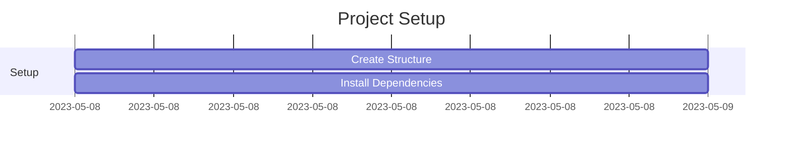

# Python Implementation Plan

## Phase 1: Project Setup (Day 1)



### Tasks:
1. Remove TypeScript/Node.js files:
   - Delete package.json
   - Delete tsconfig.json
   - Delete node_modules (if exists)

2. Set up Python environment:
```bash
# Create virtual environment
python -m venv venv

# Install dependencies
pip install -r requirements.txt

# Install development tools
pip install black isort mypy pytest
```

3. Create initial project structure:
```
hospital-monitoring/
├── src/
│   ├── functions/
│   ├── lib/
│   └── utils/
├── tests/
├── requirements.txt
└── serverless.yml
```

## Phase 2: Core Infrastructure (Days 1-2)

### 1. DynamoDB Tables Setup
```yaml
# serverless.yml DynamoDB configuration
Resources:
  PatientsTable:
    Type: AWS::DynamoDB::Table
    Properties:
      TableName: ${self:custom.tableName}-patients
      BillingMode: PAY_PER_REQUEST
      AttributeDefinitions:
        - AttributeName: PK
          AttributeType: S
        - AttributeName: SK
          AttributeType: S
```

### 2. Lambda Functions
```python
# Basic Lambda handler structure
def handle(event: dict, context: Any) -> dict:
    try:
        # Function logic here
        return {
            'statusCode': 200,
            'body': json.dumps({'message': 'Success'})
        }
    except Exception as e:
        logger.error(f"Error: {str(e)}")
        return {
            'statusCode': 500,
            'body': json.dumps({'error': str(e)})
        }
```

## Phase 3: Data Processing (Days 3-4)

### 1. CSV Processing
```python
# Example CSV processor
def process_csv(file_content: str) -> List[Dict]:
    df = pd.read_csv(StringIO(file_content))
    return df.to_dict('records')
```

### 2. Data Validation
```python
# Pydantic models for validation
class PatientData(BaseModel):
    patient_id: str
    first_name: str
    last_name: str
    date_of_birth: datetime
    gender: str
```

## Phase 4: Monitoring System (Days 5-6)

### 1. Query Implementation
```python
# Example monitoring query
def get_patients_without_tests(hours: int = 48) -> List[Dict]:
    response = table.query(
        IndexName='MonitoringIndex',
        KeyConditionExpression='#status = :status AND hoursSinceTest >= :hours',
        ExpressionAttributeNames={'#status': 'status'},
        ExpressionAttributeValues={
            ':status': 'Active',
            ':hours': hours
        }
    )
    return response['Items']
```

### 2. WebSocket Implementation
```python
# WebSocket handler
def handle_websocket(event: dict, context: Any) -> dict:
    connection_id = event['requestContext']['connectionId']
    route_key = event['requestContext']['routeKey']
    
    if route_key == '$connect':
        return handle_connect(connection_id)
    elif route_key == '$disconnect':
        return handle_disconnect(connection_id)
```

## Phase 5: Testing and Deployment (Days 7-8)

### 1. Test Implementation
```python
# Example test case
def test_process_patient_data():
    # Arrange
    test_data = {
        'patient_id': 'P123',
        'first_name': 'John',
        'last_name': 'Doe'
    }
    
    # Act
    result = process_patient_data(test_data)
    
    # Assert
    assert result['PK'] == 'PATIENT#P123'
    assert result['SK'] == 'METADATA'
```

### 2. Deployment Strategy
```bash
# Development deployment
serverless deploy --stage dev

# Production deployment
serverless deploy --stage prod
```

## Success Criteria

### 1. Performance Metrics
- Query response time < 1s
- Data processing time < 5s
- Real-time updates < 2s

### 2. Code Quality
- 90% test coverage
- Type hints throughout
- Black/isort formatting
- MyPy type checking

### 3. Monitoring
- CloudWatch metrics
- Error tracking
- Performance monitoring

## Development Guidelines

### 1. Code Style
```python
# Example well-structured function
def process_data(data: Dict[str, Any]) -> Result[Dict, Error]:
    """Process incoming data and store in DynamoDB.
    
    Args:
        data: Dictionary containing patient data
        
    Returns:
        Result containing processed data or error
    """
    try:
        # Validate data
        validated_data = PatientData(**data)
        
        # Transform to DynamoDB format
        db_item = transform_to_dynamo(validated_data)
        
        # Store in DynamoDB
        store_in_dynamo(db_item)
        
        return Ok(db_item)
    except ValidationError as e:
        return Err(Error('ValidationError', str(e)))
    except Exception as e:
        return Err(Error('ProcessingError', str(e)))
```

### 2. Error Handling
```python
class ApplicationError(Exception):
    """Base class for application errors."""
    def __init__(self, message: str, details: Dict = None):
        super().__init__(message)
        self.details = details or {}
```

### 3. Logging
```python
from aws_lambda_powertools import Logger
logger = Logger()

@logger.inject_lambda_context
def handle(event: Dict, context: Any) -> Dict:
    logger.info("Processing event", extra={"event": event})
```

This implementation plan provides a structured approach to building the hospital monitoring system using Python and serverless technologies, with clear milestones and quality standards.