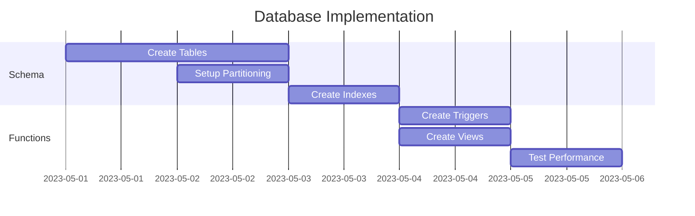
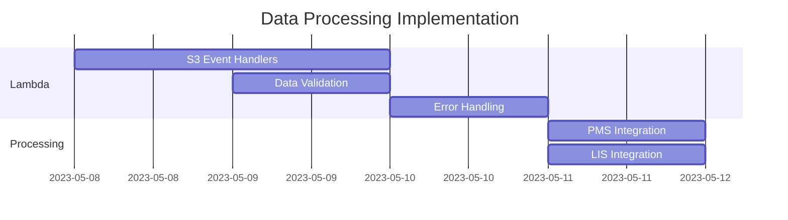
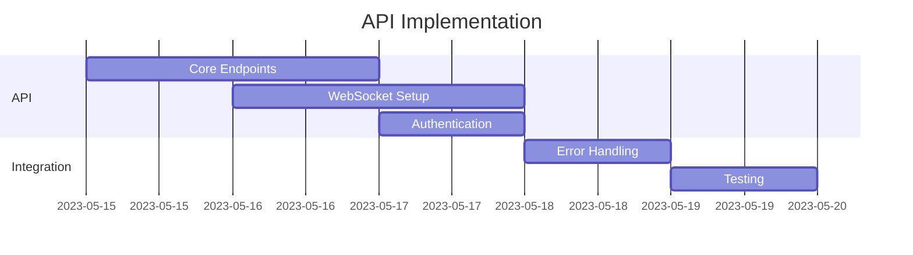
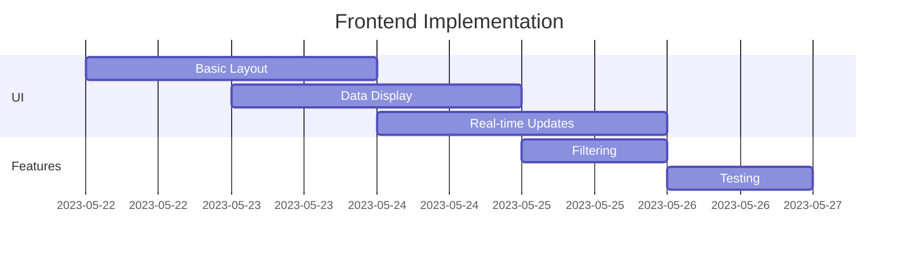

# Implementation Roadmap

## Phase 1: Core Database Setup (Week 1)



### Priority Tasks
1. Create base tables with monitoring optimizations
2. Set up partitioning for lab_tests and monitoring_queue
3. Implement triggers for real-time updates
4. Create materialized views for monitoring
5. Performance testing and optimization

## Phase 2: Data Processing (Week 2)



### Priority Tasks
1. Implement S3 event handlers
2. Create data validation layer
3. Implement error handling and retry logic
4. Set up monitoring and logging
5. Performance optimization for data ingestion

## Phase 3: API Layer (Week 2-3)



### Priority Tasks
1. Implement core REST endpoints
2. Set up WebSocket for real-time updates
3. Implement authentication and authorization
4. Create API documentation
5. Performance testing

## Phase 4: Frontend Development (Week 3-4)



### Priority Tasks
1. Create patient monitoring dashboard
2. Implement real-time updates via WebSocket
3. Add filtering and sorting capabilities
4. Implement alert notifications
5. UI/UX testing

## Implementation Priorities

### 1. Core Monitoring Functionality
```python
# Key monitoring query performance targets
MONITORING_QUERY_TIME = 100  # milliseconds
REALTIME_UPDATE_LATENCY = 500  # milliseconds
MAX_BATCH_PROCESSING_TIME = 1000  # milliseconds
```

### 2. Data Processing Performance
```python
# Processing targets
MAX_PROCESSING_DELAY = 5  # seconds
BATCH_SIZE = 1000  # records
MAX_MEMORY_USAGE = 512  # MB
```

### 3. System Reliability
```python
# Reliability targets
UPTIME_TARGET = 99.9  # percent
MAX_ERROR_RATE = 0.1  # percent
DATA_CONSISTENCY_CHECK_INTERVAL = 300  # seconds
```

## Testing Strategy

### 1. Unit Tests
- Database operations
- Data processing logic
- API endpoints
- Frontend components

### 2. Integration Tests
- End-to-end data flow
- WebSocket functionality
- Alert generation
- Real-time updates

### 3. Performance Tests
- Query response times
- Data processing throughput
- WebSocket scalability
- Frontend responsiveness

## Monitoring and Alerts

### 1. System Health
```yaml
Metrics:
  - Database response time
  - API latency
  - WebSocket connections
  - Error rates

Alerts:
  - High latency (>500ms)
  - Error rate spike (>1%)
  - Processing delays (>10s)
  - Database connection issues
```

### 2. Business Metrics
```yaml
Metrics:
  - Patients without tests >48h
  - Average test interval
  - Processing backlog
  - Alert response time

Alerts:
  - Critical patient count increase
  - Processing pipeline delays
  - Data consistency issues
  - System capacity warnings
```

## Go-Live Checklist

### 1. Pre-deployment
- [ ] Database schema verified
- [ ] All tests passing
- [ ] Performance benchmarks met
- [ ] Documentation complete
- [ ] Monitoring configured

### 2. Deployment
- [ ] Database migration script tested
- [ ] Backup strategy verified
- [ ] Rollback plan documented
- [ ] Alert thresholds configured
- [ ] Load balancing tested

### 3. Post-deployment
- [ ] Monitor system performance
- [ ] Verify data consistency
- [ ] Check alert functionality
- [ ] Validate real-time updates
- [ ] Review error logs

This roadmap provides a structured approach to implementing the hospital monitoring system, with clear priorities and measurable targets at each phase.