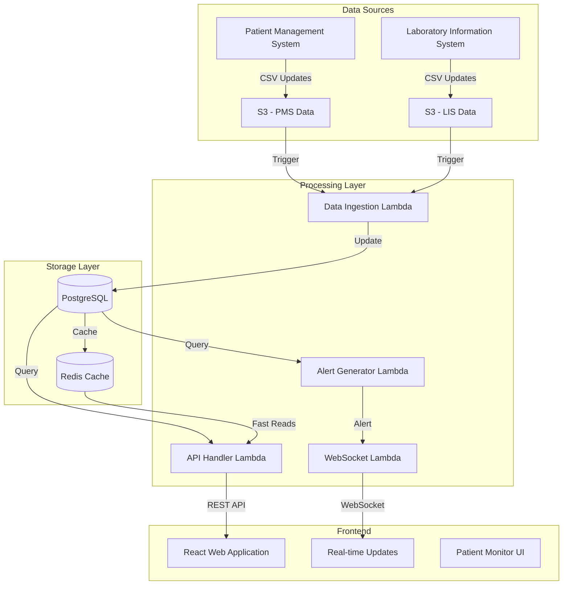

# Hospital Data Integration System Architecture

## System Overview



## Architecture Components

### 1. Data Ingestion Layer
- **Purpose**: Process incoming CSV files from S3 and update PostgreSQL
- **Components**:
  - S3 Event Triggers
  - Lambda Functions for data transformation
  - PostgreSQL for data storage
- **Key Features**:
  - Automatic trigger on file upload
  - Data validation and transformation
  - Transactional updates
  - Error handling and retry mechanism

### 2. Processing Layer
- **Purpose**: Monitor patient data and generate alerts
- **Components**:
  - Alert Generator Lambda
  - WebSocket handler for real-time updates
  - Redis for caching
- **Key Features**:
  - Scheduled checks for patients without tests
  - Real-time alert generation
  - WebSocket message broadcasting
  - Performance optimization through caching

### 3. API Layer
- **Purpose**: Serve data to frontend application
- **Components**:
  - API Gateway
  - Lambda Functions for request handling
  - Connection management for WebSocket
- **Key Features**:
  - REST API endpoints
  - WebSocket connections for real-time updates
  - Authentication and authorization
  - Rate limiting and throttling

### 4. Frontend Application
- **Purpose**: Display patient monitoring interface
- **Components**:
  - React application
  - Material-UI components
  - WebSocket client
- **Key Features**:
  - Real-time data updates
  - Filtering and sorting
  - Alert notifications
  - Responsive design

## API Design

### REST Endpoints

```yaml
/api/v1/patients:
  get:
    description: List all patients
    parameters:
      - name: ward
        in: query
        type: string
      - name: status
        in: query
        type: string
      - name: last_test_hours
        in: query
        type: integer

/api/v1/patients/{patient_id}:
  get:
    description: Get patient details
    parameters:
      - name: patient_id
        in: path
        required: true

/api/v1/patients/{patient_id}/tests:
  get:
    description: Get patient's test history
    parameters:
      - name: patient_id
        in: path
        required: true
      - name: from_date
        in: query
        type: string
```

### WebSocket Events

```yaml
# Client -> Server
connect:
  - type: subscribe
    data:
      ward: string
      alert_types: array

# Server -> Client
messages:
  - type: patient_alert
    data:
      patient_id: string
      alert_type: string
      message: string
      timestamp: string
```

## Performance Considerations

### 1. Database Performance
- Partitioning by date for lab_tests table
- Materialized views for common queries
- Strategic indexing for frequent access patterns
- Connection pooling for Lambda functions

### 2. Real-time Updates
- WebSocket connections for instant alerts
- Redis caching for frequent queries
- Batch processing for bulk updates
- Optimistic locking for concurrent updates

### 3. Scaling Strategy
- Horizontal scaling through read replicas
- Caching frequently accessed data
- Connection pooling optimization
- Auto-scaling Lambda configurations

## Security Measures

### 1. Data Protection
- Encryption at rest for PostgreSQL
- SSL/TLS for data in transit
- JWT authentication for API access
- Role-based access control

### 2. Monitoring
- CloudWatch metrics and alarms
- Database query performance monitoring
- API gateway request logging
- Lambda function error tracking

## Deployment Strategy

### 1. Infrastructure as Code
```yaml
# AWS CloudFormation/Terraform structure
Resources:
  Database:
    Type: AWS::RDS::DBInstance
    Properties:
      Engine: postgres
      EngineVersion: 14
      MultiAZ: true
      
  ApiGateway:
    Type: AWS::ApiGateway::RestApi
    
  Lambdas:
    - DataIngestion
    - AlertGenerator
    - ApiHandler
    - WebSocketHandler
```

### 2. CI/CD Pipeline
- Automated testing
- Database migration management
- Blue-green deployments
- Rollback procedures

## Monitoring and Alerting

### 1. System Health
- Database connection monitoring
- Lambda execution metrics
- API response times
- WebSocket connection status

### 2. Business Metrics
- Patients without tests > 48 hours
- Test result processing times
- Alert generation frequency
- System usage patterns

## Future Considerations

### 1. Scalability
- Support for multiple hospitals
- Geographic distribution
- Data archival strategy
- Performance optimization

### 2. Features
- Mobile application support
- Advanced analytics dashboard
- Machine learning predictions
- Integration with additional systems

## Implementation Phases

### Phase 1: Core Infrastructure
1. Set up PostgreSQL database
2. Implement data ingestion Lambdas
3. Create basic API endpoints
4. Develop minimal frontend

### Phase 2: Real-time Features
1. Add WebSocket support
2. Implement alert system
3. Add Redis caching
4. Enhance frontend with real-time updates

### Phase 3: Optimization
1. Implement advanced caching
2. Add monitoring and alerting
3. Optimize database queries
4. Enhance security measures

This architecture provides a robust foundation for the hospital data integration system while maintaining flexibility for future enhancements and scaling requirements.